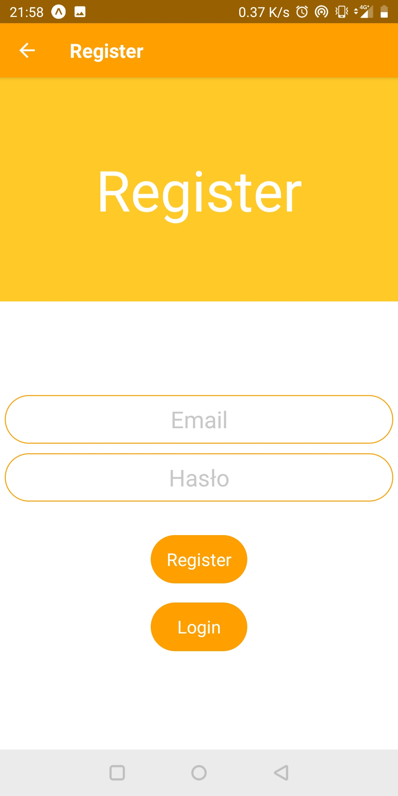

# ReactNative-EXPO-FirebaseApp

Simple authentication by using Google Firebase system and connection with Firebase Database to show some data.

## Getting Started

These instructions will get you a copy of the project up and running on your local machine.

### Installing

1
```
copy repository
```
2
```
uznip
```
3
```
npm install
```
4
```
npm start
```
5
```
using mobile app copy QR code and run app
```


## Built With

* ReactNative
* NODE
* EXPO
* npm

## Authors

* **Artur Haluch** 

## Screens




